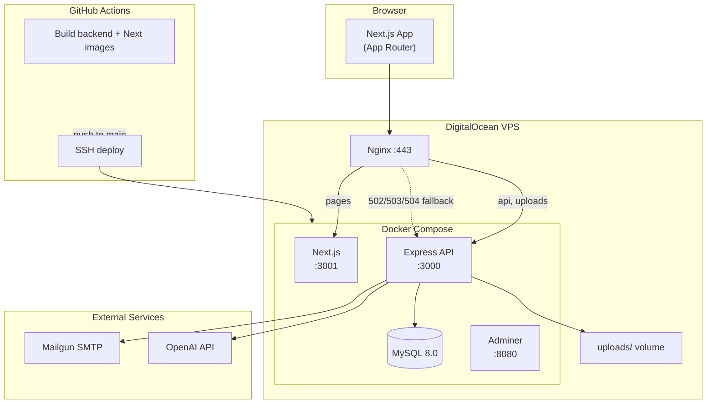

# Warranty Wallet

[](https://dejanvitomirov.com/warrantywallet/)
[](LICENSE)
[](https://nodejs.org/)
[](https://react.dev/)

**Warranty Wallet** is a production-grade, full-stack web application for digitizing, organizing, and managing product warranties. Users upload PDF receipts and warranty documents, track expiration dates on a personal dashboard, receive automated email reminders, and submit warranty claims directly to sellers — with an AI assistant available for in-app guidance.

**Live application:** [https://dejanvitomirov.com/warrantywallet/](https://dejanvitomirov.com/warrantywallet/)

---

## Table of Contents

- [Features](#features)
- [Architecture Overview](#architecture-overview)
- [Technology Stack](#technology-stack)
- [Project Structure](#project-structure)
- [Getting Started](#getting-started)
- [Environment Variables](#environment-variables)
- [API Overview](#api-overview)
- [Testing](#testing)
- [Deployment & CI/CD](#deployment--cicd)
- [Documentation](#documentation)
- [Migration](#migration)
- [License](#license)
- [Author](#author)

---

## Features

| Area | Capability |
|------|------------|
| **Authentication** | JWT access tokens (15 min) + httpOnly refresh cookies (7 days), automatic silent refresh |
| **Warranty Management** | CRUD operations with PDF upload, inline PDF viewing, active/expired status |
| **Notifications** | Daily cron job emails users 14 days before warranty expiration |
| **Warranty Claims** | One-click claim emails to sellers with attached PDF and user details |
| **AI Assistant** | OpenAI-powered chatbot scoped to app features and warranty knowledge |
| **Account Management** | Profile updates, account deletion with cascade cleanup |
| **Audit Logging** | Server-side activity log for sign-up, warranty create/delete events |
| **Marketing Site** | Landing, About, Features, FAQ pages with per-route SEO meta tags |
| **UX** | Mobile-first responsive layout, Framer Motion animations, lazy-loaded routes |

---

## Architecture Overview

Warranty Wallet uses a **Next.js frontend** with an **Express API backend**, deployed via a strangler pattern on nginx. Next.js serves all user-facing pages; Express handles the API, file uploads, and emergency Vite SPA fallback.



### Backend — Layered Architecture

```
Request → Route → Middleware → Controller → Service → MySQL / File System
```

- **Routes** define HTTP endpoints and attach middleware (auth, file upload).
- **Controllers** handle request/response and delegate to services.
- **Services** contain business logic, database queries, and file operations.
- **Core utilities** (`httpResponses`, `logActivity`) standardize API responses and audit trails.

### Frontend — Next.js App Router

```
app/            → Routes (marketing, auth, app, account)
components/     → UI by domain (auth, warranties, account, marketing, ai)
hooks/          → Data fetching & form logic
styles/         → SCSS 7-1 design system
lib/            → API client, metadata, animations
providers/      → AuthProvider, global AiChat
```

Legacy Vite SPA (`src/frontend/`) remains as an nginx outage fallback only. See [MIGRATION.md](MIGRATION.md).

### Authentication Flow

1. User logs in → server returns a short-lived **access token** (JSON) and sets an **httpOnly refresh cookie**.
2. Frontend stores the access token in `localStorage` and attaches it as a `Bearer` header.
3. `useSecureRequest` intercepts expired tokens, calls `/api/refresh-token`, and retries failed requests.
4. `AuthProvider` schedules proactive refresh 30 seconds before token expiry and on tab visibility change.

---

## Technology Stack

### Frontend (Next.js — primary)

| Category | Technology | Purpose |
|----------|------------|---------|
| Framework | Next.js 15, React 19 | App Router, SSR metadata |
| Routing | Next.js App Router | File-based routes with `/warrantywallet` base path |
| HTTP | Axios | API client (`lib/api/client.js`) |
| UI | Bootstrap 5, React Bootstrap | Grid, components, responsive layout |
| Styling | Sass (7-1 pattern) | `src/next/styles/` design system |
| Animation | Framer Motion | Page transitions and micro-interactions |
| Forms | React Datepicker | Purchase and expiry date inputs |
| Modals | React Modal | Confirmation dialogs |
| Testing | Jest, React Testing Library | Component tests in `src/next/__tests__/` |
| Linting | ESLint (eslint-config-next) | Code quality |

### Frontend (Legacy Vite — fallback only)

The Vite SPA in `src/frontend/` is retained for nginx emergency fallback. Do not use for new development. See [MIGRATION.md](MIGRATION.md).

### Backend

| Category | Technology | Purpose |
|----------|------------|---------|
| Runtime | Node.js 22 | Server runtime |
| Framework | Express 4 | HTTP API, static file serving |
| Database | MySQL 8 (mysql2) | Persistent storage with connection pooling |
| Auth | jsonwebtoken, bcryptjs | JWT tokens, password hashing |
| File upload | Multer | PDF storage to `uploads/` volume |
| Email | Nodemailer + Mailgun SMTP | Claim and expiration notifications |
| Scheduling | node-cron | Daily warranty expiration checks |
| AI | OpenAI SDK (gpt-4o-mini) | In-app assistant |

### DevOps & Infrastructure

| Category | Technology | Purpose |
|----------|------------|---------|
| Containerization | Docker, Docker Compose | Reproducible dev and prod environments |
| CI/CD | GitHub Actions | Build backend + Next images, SSH deploy to VPS |
| Hosting | DigitalOcean VPS | Production server |
| Domain | Namecheap → dejanvitomirov.com | Public URL with sub-path deployment |
| DB Admin | Adminer | Database management (production compose) |

---

## Project Structure

```
warranty-wallet/
├── .github/workflows/
│   └── deploy.yml              # CI/CD — builds backend + Next images, deploys to VPS
├── db_init/
│   └── init.sql                # Database schema bootstrap
├── deploy/nginx/
│   ├── warranty-wallet.conf    # Production strangler routing
│   └── README.md               # Nginx setup guide
├── MIGRATION.md                # Next.js migration status and decommission checklist
├── src/
│   ├── backend/
│   │   ├── ai/                 # OpenAI chat endpoint
│   │   ├── auth/               # Login, signup, refresh, JWT middleware
│   │   ├── config/             # MySQL connection pool
│   │   ├── core/               # HTTP helpers, activity logging
│   │   ├── email/              # Nodemailer + Mailgun integration
│   │   ├── handlers/           # Cross-cutting request handlers
│   │   ├── user/               # Profile CRUD
│   │   ├── warranty/           # Warranty CRUD + PDF upload
│   │   ├── uploads/            # Persisted PDF files (volume-mounted)
│   │   ├── app.js              # Express app (API + legacy SPA static)
│   │   ├── server.js           # Entry point, DB retry, cron init
│   │   ├── cronJobs.js         # Expiration notification scheduler
│   │   └── Dockerfile          # Multi-stage prod image (API + embedded Vite fallback)
│   ├── next/                   # Primary frontend (Next.js App Router)
│   │   ├── app/                # Routes: marketing, auth, app, account
│   │   ├── components/         # UI by domain
│   │   ├── hooks/              # Data & form logic
│   │   ├── styles/             # SCSS 7-1 design system
│   │   ├── lib/                # API client, metadata, animations
│   │   ├── providers/          # AuthProvider, AiChat
│   │   ├── __tests__/          # Jest component tests
│   │   └── Dockerfile          # Standalone Next.js production image
│   └── frontend/               # Legacy Vite SPA (nginx fallback only — do not extend)
│       ├── features/           # auth, warranties, account, ai
│       ├── styles/             # Original SCSS (copied to src/next/styles/)
│       └── ...                 # See MIGRATION.md for decommission plan
├── docker-compose.yml          # Production stack (mysql, backend, next, adminer)
├── docker-compose.dev.yml      # Local development stack
└── README.md
```

---

## Getting Started

### Prerequisites

- [Docker](https://docs.docker.com/get-docker/) and Docker Compose
- [Node.js](https://nodejs.org/) 20+ (for local non-Docker development)
- Git

### Option A — Docker (Recommended)

1. **Clone the repository**

   ```bash
   git clone https://github.com/Vitomirov/warranty-wallet.git
   cd warranty-wallet
   ```

2. **Create environment file** at the project root:

   ```bash
   cp .env.development.example .env.development   # if example exists
   # Or create .env.development manually — see Environment Variables below
   ```

3. **Start the development stack**

   ```bash
   docker compose -f docker-compose.dev.yml up --build
   ```

4. **Open the application**

   | Service | URL |
   |---------|-----|
   | **Next.js (primary UI)** | http://localhost:3001/warrantywallet/ |
   | Backend API | http://localhost:3000/api/test |
   | Legacy Vite (optional) | http://localhost:5173/warrantywallet/ |
   | MySQL | localhost:3307 |

### Option B — Local Node.js

**Backend:**

```bash
cd src/backend
npm install
npm run dev          # nodemon on port 3000
```

**Next.js (primary frontend):**

```bash
cd src/next
npm install
npm run dev          # http://localhost:3001/warrantywallet/
```

Next.js proxies `/api/*` and `/uploads/*` to Express via `next.config.js` rewrites (`LEGACY_API_URL` defaults to `http://localhost:3000`).

---

## Environment Variables

Create `.env.development` (local) or `.env.production` (VPS/Docker) at the **project root**.

| Variable | Required | Description |
|----------|----------|-------------|
| `SECRET_KEY` | Yes | JWT access token signing secret |
| `REFRESH_SECRET_KEY` | Yes | JWT refresh token signing secret |
| `DB_HOST` | Yes | MySQL host (`mysql` in Docker, `localhost` locally) |
| `DB_USER` | Yes | Database user |
| `DB_PASSWORD` | Yes | Database password |
| `DB_DATABASE` | Yes | Database name (`warranty_db`) |
| `MYSQL_ROOT_PASSWORD` | Yes | MySQL root password (Docker init) |
| `MAILGUN_SMTP_HOST` | Yes | Mailgun SMTP hostname |
| `MAILGUN_SMTP_PORT` | Yes | SMTP port (typically `587`) |
| `MAILGUN_SMTP_USER` | Yes | Mailgun SMTP username |
| `MAILGUN_SMTP_PASSWORD` | Yes | Mailgun SMTP password |
| `MAIL_FROM_ADDRESS` | Yes | Sender email address |
| `OPENAI_API_KEY` | Yes | OpenAI API key for AI assistant |
| `PORT` | No | Backend port (default `3000`) |
| `NODE_ENV` | No | `development` or `production` |
| `VITE_API_BASE_URL` | Yes* | Legacy Vite API base URL (*build-time for backend fallback image) |
| `NEXT_PUBLIC_BASE_PATH` | No | Next.js base path (default `/warrantywallet`) |
| `LEGACY_API_URL` | No | Next dev proxy target for API (default `http://localhost:3000`) |
| `BACKEND_BASE_URL` | No | Backend public URL (production) |

> **Security note:** Never commit `.env` files. Production secrets are injected via GitHub Actions secrets during deployment.

---

## API Overview

All authenticated endpoints require `Authorization: Bearer <accessToken>`.

| Method | Endpoint | Auth | Description |
|--------|----------|------|-------------|
| `POST` | `/api/login` | No | Authenticate user |
| `POST` | `/api/signup` | No | Register new user |
| `POST` | `/api/refresh-token` | Cookie | Refresh access token |
| `GET` | `/api/me` | Yes | Get current user profile |
| `PUT` | `/api/me` | Yes | Update profile |
| `DELETE` | `/api/me` | Yes | Delete account |
| `GET` | `/api/warranties` | Yes | List user warranties |
| `GET` | `/api/warranties/:id` | Yes | Get warranty details |
| `POST` | `/api/warranties` | Yes | Create warranty (multipart PDF) |
| `DELETE` | `/api/warranties/:id` | Yes | Delete warranty |
| `GET` | `/api/warranties/pdf/:id` | Yes | Stream warranty PDF |
| `POST` | `/api/warranty/claim` | Yes | Send claim email to seller |
| `POST` | `/api/ai` | No | AI assistant prompt |
| `GET` | `/api/test` | No | Health check |
| `GET` | `/api/testdb` | No | Database connectivity check |

Full request/response details are in the [API Overview](#api-overview) table above. See [MIGRATION.md](MIGRATION.md) for architecture context.

---

## Testing

**Next.js (primary):**

```bash
cd src/next
npm test
```

Current coverage: `LoginForm` component tests. More tests are being ported from legacy.

**Legacy Vite (being phased out):**

```bash
cd src/frontend
npm test
```

Legacy tests cover `LogIn` and `SignUp` components.

---

## Deployment & CI/CD

Production deployment is fully automated via GitHub Actions (`.github/workflows/deploy.yml`):

1. **Trigger** — Push to `main` branch
2. **Build** — Build and push two Docker images to GHCR:
   - `warranty-wallet-backend` — Express API + embedded Vite fallback SPA
   - `warranty-wallet-next` — Next.js standalone app
3. **Deploy** — SSH into DigitalOcean VPS, write `.env.production` from GitHub Secrets, sync nginx config, pull images, recreate containers

Production stack (`docker-compose.yml`):

| Container | Image / Build | Port | Role |
|-----------|---------------|------|------|
| `warranty_db` | mysql:8.0 | internal | Database with persistent volume |
| `warranty_backend` | Multi-stage Dockerfile | 3000 | API + legacy Vite fallback SPA |
| `warranty_next` | Next.js Dockerfile | 3001 | Primary UI (all pages) |
| `warranty_adminer` | adminer:latest | 8080 | Database admin UI |

Nginx on the VPS routes all `/warrantywallet/*` pages to Next.js (`:3001`), with automatic fallback to the legacy Vite SPA on 502/503/504. See [deploy/nginx/README.md](deploy/nginx/README.md).

---

## Documentation

| Document | Description |
|----------|-------------|
| [MIGRATION.md](MIGRATION.md) | Next.js migration status, route mapping, decommission checklist |
| [deploy/nginx/README.md](deploy/nginx/README.md) | Nginx strangler routing, VPS setup, verification |

## Migration

The application is migrating from Vite + React Router to Next.js App Router. All user-facing features are live on Next.js in production. The legacy Vite SPA remains as an emergency fallback.

See **[MIGRATION.md](MIGRATION.md)** for the full status, route mapping, and step-by-step decommission plan.

---

## License

This project is licensed under the [MIT License](LICENSE).

---

## Author

**Dejan Vitomirov**

- Website: [dejanvitomirov.com](https://dejanvitomirov.com)
- Email: dejan.vitomirov@gmail.com
- GitHub: [@Vitomirov](https://github.com/Vitomirov)
